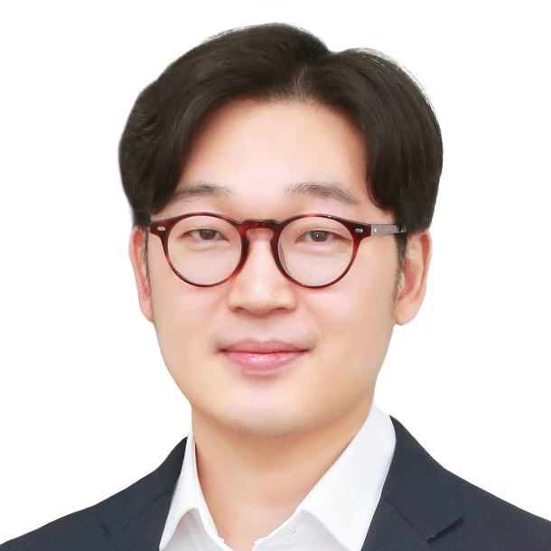

  
  

	I am an <b>Associate Professor</b> in the <a href="https://gsds.snu.ac.kr">Graduate School of Data Science</a> at <a href="https://www.snu.ac.kr">Seoul National University</a>, directing Causality Lab . Prior to joining Seoul National University, 
	I was an 
	Associate Research Scientist at Columbia University and Postdoctoral Research Associate at Computer Science, Purdue University
	working with Prof. <a href="http://causalai.net">Elias Bareinboim</a>.
	I got my Ph.D. in College of Information Sciences and Technology, Pennsylvania State University, University Park, under the supervision of Prof. <a href="https://faculty.ist.psu.edu/vhonavar/index.htm">Vasant Honavar</a>.

Currently, I am working on the theory and application of causality from the perspectives of machine learning, artificial intelligence, and data science. In particular, I am interested in causal discovery, sequential decision-making, and the identifiability and estimation of causal effects in diverse settings.
During my Ph.D. study, I focused on causal discovery in a relational domain. 
[<a href="/assets/cv.pdf">CV</a>]
  

  

<!-- 
<em>Causality lab. is seeking self-motivated **undergraduate interns** (Spring 2024) with strong problem-solving abilities and excellent communication skills who can work in a collaborative environment.
Please email me your resume and transcript if you are interested in solving problems in causal inference (check out Research Topics below).</em>
 -->

## Research Interests

- **Causal Inference** (how can we identify and estimate the effect of an intervention?),  **Causal Decision Making** (how can we utilize causal information in decision making?),  **Causal Discovery** (how can we establish causal relationships from complex data?) 
- (Future) Developing theories and applications for *health* and *social* domains with causality as a first principle. Developing robust machine learning models and algorithms utilizing causal knowledge. Artificial general intelligence and causality (how can an agent equip a causal mindset. how to counterfactually reason about its actions and consequences.)

## Employment & Education

| :--- || ---: | ---: | ---: |
| **Seoul National University**  || Associate Professor | |2025.03---present |
| **Seoul National University**  || Assistant Professor | |2021.03---2025.02 |
| **Columbia Univeristy**  || Associate Research Scientist | |2019---2021 |
| **Purdue University**  | |Postdoctoral Research Associate | |2018---2019 |
| **Pennsylvania State University** | |Ph.D. | |2013---2018 |

## News
- (Sep 2025) Two papers on Structural Causal Bandits are accepted at **NeurIPS**.
- (Aug 2025) Yesong was awarded the NRF Ph.D. fellowship.
- (Apr 2025) We’re excited to host research talks by Julius von Kügelgen and Junhyung Park from ETH Zurich!
- (Feb 2025) Dong Kyu's paper on single source domain generalization is accepted at CVPR 2025!
- (Nov 2024) Jonghwan and Jeongsup won **first prize** at DATA AI competition (by KISTI)
- (Nov 2024) Our paper on IV representation learning won a **Best Paper Award** at 2024 Fall Conference of Korean AI Association
- (Oct 2024) Two NeurIPS workshop papers are accepted.
- (Sep 2024) A paper on a graphical criterion for sequential adjustment is accepted at **NeurIPS**!
- (Aug 2024) Congratulations, **Hyeonji**, on receiving NRF's **Research Scholarship** for Master students!
- (Aug 2024) Congratulations to **Inwoo** for being chosen as a recipient of the **Yulchon AI STAR** Scholarship!
- (May 2024) Two papers are accepted at **ICML 2024**. Thanks for students' incredible efforts!
- (Apr 2024) Two papers are accepted at **UAI 2024**. Super congrats!
- (Jan 2024) Soheun's paper on cyclic causal discovery is accepted at **AISTATS**. Congrats!
- (Nov 2023) Two NeurIPS workshop papers are accepted.
- (Jun 2023) Causal dynamics learning paper by Inwoo is accepted to a workshop at **ICML 2023**.
- (Jan 2023) Inwoo's paper on local causal discovery using neural network is accepted at **CLeaR 2023**!

## Academic Activities

Program Committee/Reviewed for 

- 2026 AAAI, AISTATS
- 2025 AAAI, KDD (_outstanding reviewer_), ICLR, AISTATS, CLeaR, ICML (_Area Chair_), NeurIPS (_Area Chair_)
- 2024 NeurIPS (_Area Chair_), CLeaR, ICML, UAI, JMLR (2x), ECAI, ARR (June), CI4TS at UAI
- 2023 UAI, NeurIPS (_top reviewer_), Journal of Causal Inference (JCI), CI4TS at UAI
- 2022 ICLR  (_highlighted reviewer_), AAAI, AISTATS, CLeaR, ICML, UAI (_top reviewer_), JCI, NeurIPS
- 2021 ICLR, AAAI, AISTATS, UAI, ICML, NeurIPS, JAIR, Why now? workshop at NeurIPS
- 2020 NeurIPS, UAI, ICML (_top reviewer_), AAAI, AISTATS, IEEE TPAMI, Journal of Artificial Intelligence (AIJ), JCI, CDML Workshop at NeurIPS
- 2019 NeurIPS (_Best Reviewer Award_), WHY conference,
 JMLR, 2017 Causality Workshop at UAI, 2016 ACM CHI, 2014 ACM TIST

## Research Projects

- Causal Machine Learning (NRF, PI, 2023~27 with Innovative Research Lab Initiation Grant)
- Self-Motivated AI: Developing self-directed AI agents that can solve new problems (IITP, Co-I, 2022~26, PI: Byoung-Tak Zhang)
- Center for Optimizing Hyperscale AI Models and Platforms (NRF, Co-I, 2023.06~, PI: Jaejin Lee)
- Metabolomic Big Data Analysis (MFDS, Co-I, 2023~25)
- Scalable Causal Discovery (LG AI Research, PI, 2025~26)
<!-- - Counterfactual Evaluation of Logged Feedback (Balance Hero, PI, 2025~26) -->

##  Causality Lab. 

### Research Topics
- Non-stationary Temporal Causal Discovery
- Representation Learning for Causal Inference
- Explainability/Interpretability for Causal Inference (Uncertainty Quantification)
- Efficient Causal Decision Making in Generalized Settings (Non-stationary, without Sufficiency, Counterfactually)
- Deep Generative Models for Temporal Causal Inference
- Causal Understanding of Multi-Modal Models
- Scalable and Stable Causal Discovery
- Causal Inference/Discovery with Text/LLM
- misc. (fairness, recommender systems, domain generalization, ... )

### Ph.D. program 
- [Yeha Kim](https://yeha-777.github.io), Causality & Trustworthy AI (L2–3)
- [Yesong Choe](https://lovelyesong.github.io), efficient causal inference
- [Yeahoon Kwon](https://deepstroy.github.io), causal imitation learning
- [Min Woo Park](https://minwoopark96.github.io), causal decision making
- [Yeo Dong Youn](https://yeodongyoun1995.github.io), causal NLP, causal ML
- Byeonghui Lim, causal decision making
- Jonghwan Kim, robust and efficient causal discovery
- Jung Soo Kim, representation learning for instrumental variables

### integrated Master/Ph.D. program 
- GyeongChan Han
- Taehui Yun, Causal Deep Generative Model, Causal Inference with Time-series
- Bogeun Kim
- Kangsan Kim
- Youngin Jang
- Hyunbin Moon

### Master students
- [Sujeong Oh](https://www.linkedin.com/in/5sudeng), causal machine learning
- [Daehui Park](https://www.linkedin.com/in/대희-박-201500222/),  causal inference
- [Younsuk Yeom](https://www.linkedin.com/in/younsuk-yeom78/), causal discovery, causal representation learning
- [Eunseo Lee](https://www.linkedin.com/in/은서-이-9497a8315/)
- Sumin Cho
- [Sangyeon Cho](https://www.linkedin.com/in/sangyeon-cho-5570682a3/),  causal data science for economic analysis
- Min Young Cho
- Juyong Sung

### Undergraduate Researchers
- Serjin Kim (SNU Economics (minor in Financial Economics, Business Administration), Summer 2025~)
- Junha Ham (SNU Liberal Studies (CSE &amp; Economics), Summer 2025~)
- Deokgyu Kim (SNU Statistics &amp; Business Administration, Summer 2025~)
- DoEun Kim (Sogang Univ. Math &amp; CSE, Summer 2025~)

### Alumni (year graduated) 
- [Inwoo Hwang](https://iwhwang.github.io) (Ph.D., <em>Columbia University Post doc</em>)
- Jaeho Jeong (mater 2025, recently graduated)
- Hyunwoo Park (master 2025, recently graduated)
- Oh Yoon Kwon (master 2025, recently graduated)
- Jihae Chung (master 2025, <em>KAI</em>)
- Hyeonji Kim (master 2025, <em>LG CNS</em>)
- Taehan Kim (master 2025, <em>National Police Agency</em>)
- Heejin Choi (master 2025, <em>SK Hynix</em>)
- Soungmin Park (master 2025, <em>LG CNS</em>)
- Jin A Choi (master 2025)
- Kwon Ho Kim (master 2025, <em>LG Uplus</em>)
- Kyung A Song (master 2024, <em>DS Trade</em>)
- Dahhee Yim (master 2024, <em>Doosan Enerbility</em>)
- Jeong Ha Moon (master 2024, <em>Coupang</em>)
- Jeongsup Park (master 2024, <em>AB180</em>)
- Chaeyoung Chung (master 2023, <em>unspecified</em>)
- [Dong Kyu Cho](https://umamicode.github.io/aboutme/) (master 2023, &rarr; NYU Ph.D. )
- Jewon Kang (master 2023, <em>KDB</em>)
- Juhyeon Kim (master 2023, <em>GSDS Ph.D. program</em>)
- (undergraduate researchers) [Soheun Yi](https://soheunyi.github.io) (&rarr; CMU Ph.D.), Jiwon Bae (&rarr; Columbia master)

## Past Projects

- Semantic Search for Korean Medical and Legal Documents (SNU, co-PI, 2022~23, PI: Hyopil Shin)
- Association and Causality in Metabolomic data (MFDS, co-PI, 2022)
- Supply Chain based Financial Keyword Analysis (NH Investment, 2021)
- Causal Discovery for Time Series (LG AI Research, PI, 2023.04~24.04)
- An algorithmic aspect of proxy-based causal inference (SNU, PI, 2021~24)
- Deep Generative Models for Causal Reasoning (LG AI Research, PI, 2024.05~25.05)

