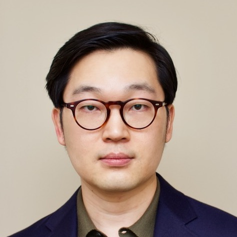

  
  

	I am an <b>Assistant Professor</b> in the <a href="https://gsds.snu.ac.kr">Graduate School of Data Science</a> at <a href="https://www.snu.ac.kr">Seoul National University</a>. Prior to joining Seoul National University, 
	I was an 
	Associate Research Scientist at Columbia University and Postdoctoral Research Associate at Computer Science, Purdue University
	working with Prof. <a href="http://causalai.net">Elias Bareinboim</a>.
	I got my Ph.D. in College of Information Sciences and Technology, Pennsylvania State University, University Park, under the supervision of Prof. <a href="https://faculty.ist.psu.edu/vhonavar/index.htm">Vasant Honavar</a>.

Currently, I am working on developing methods for applying causality in sequential decision-making
and developing theory of causal effect identifiability and transportability.
During my Ph.D. study, I focused on causal discovery in a relational domain. 
[<a href="/assets/cv.pdf">Curriculum Vitae</a>]
  

  

 

## Research Interests

- **Causal Inference** (how can we identify the effect of an intervention?),  **Causal Decision Making** (how can we utilize causal information in decision making?),  **Causal Discovery** (how can we establish causal relationships from complex data?) 
- (Future) Developing theories and applications for *health* and *social* domains with causality as a first principle by bringing ideas from *economics*. Developing robust machine learning algorithms utilizing causal knowledge.

## Employment & Education

| :--- || ---: | ---: | ---: |
| **Seoul National University**  || Assistant Professor | |2021---present |
| **Columbia Univeristy**  || Associate Research Scientist | |2019---2021 |
| **Purdue University**  | |Postdoctoral Research Associate | |2018---2019 |
| **Pennsylvania State University** | |Ph.D. | |2013---2018 |

## News
- (July 2022) Five master students joined Causality Lab!
- (May 2022) A co-authored paper on the intersection between transportability and counterfactual identification will be presented at ICML.
- (Dec 2021) Two papers on identification accepted to NeurIPS 2021 and a paper to a sequential decision making workshop at NeurIPS.
- (Jul 2021) A paper on 'counterfactual identification' (joint work with Correa and Bareinboim) is online.
- (Mar 2021) I joined Graduate School of Data Science at Seoul National University as an Assistant Professor.
- (Sep 2020) A paper on exploring the optimal policy for structural causal bandits accepted at **NeurIPS'20**!
- (Aug 2020) Invited talk at CSE AIGS, POSTECH, South Korea
- (Jun 2020) A paper on identifiability with partial-observability is accepted at **ICML'20**.

## Academic Activities

Program Committee for 

- 2022 ICLR  (Highlighted Reviewer), AAAI, AISTATS, CLeaR, ICML, UAI (Top Reviewer), JCI, NeurIPS
- 2021 ICLR, AAAI, AISTATS, UAI, ICML, NeurIPS, Journal of Artificial Intelligence Research, NeurIPS Workshop on Causal Inference and Machine Learning: Why now?
- 2020 NeurIPS, UAI, ICML (Top Reviewer Award), AAAI, AISTATS, IEEE Transactions on Pattern Analysis and Machine Intelligence (TPAMI), Journal of Artificial Intelligence (AIJ), Journal of Causal Inference (JCI), [NeurIPS Workshop on Causal Discovery and Causality-Inspired Machine Learning](https://www.cmu.edu/dietrich/causality/neurips20ws/) (CDML, Area Chair)
- 2019 NeurIPS (Best Reviewer Award), [WHY conference](https://why19.causalai.net),
 Journal of Machine Learning Research (JMLR), 2017 [Causality Workshop at UAI](https://causalai.net/causal-uai17/), 2016 ACM CHI, 2014 ACM Transactions on Intelligent Systems and Technology

## Advisee

- Yesong Choe (Ph.D. program 2021~)
- Yeahoon Kwon (Ph.D. program 2021~)
- Chaeyoung Chung (master program 2021~)
- Juhyeon Kim (master program 2021~2023)
- Taehan Kim (master program 2021~)
- Dong Kyu Cho (master program 2021~)
- Jewon Kang (master program 2021~2023)
- Jeong Ha Moon (master program 2022~)
- Jung Soo Kim (master program 2022~)
- Dahhee Yim (master program 2022~)
- Jeongsup Park (master program 2022~)
- Jonghwan Kim (master program 2022~)

## Projects

- Self-Motivated AI (IITP, co-PI, 2022~2026)
- An algorithmic aspect of proxy-based causal inference (SNU, PI, 2021~2024)
- Enabling Causal Reasoning for Large Language Model (LG AI Research, PI, 2023~2024)

### Past Projects

- Association and Causality in Metabolomic data (MFDS, co-PI, 2022)